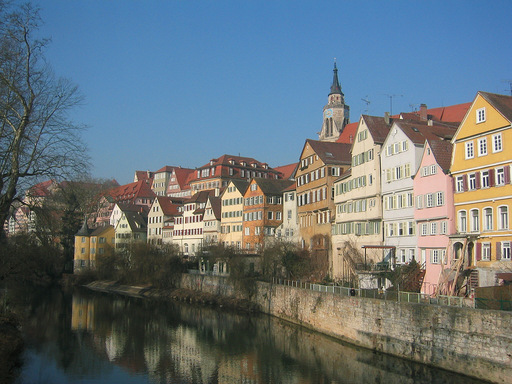
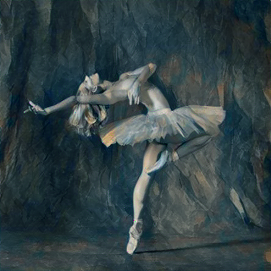
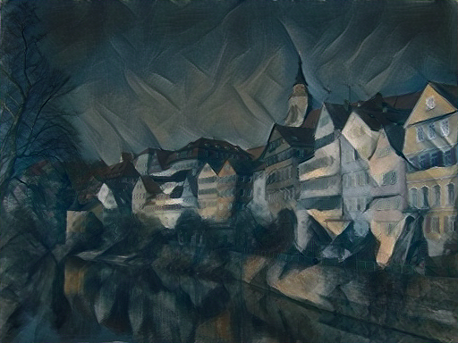
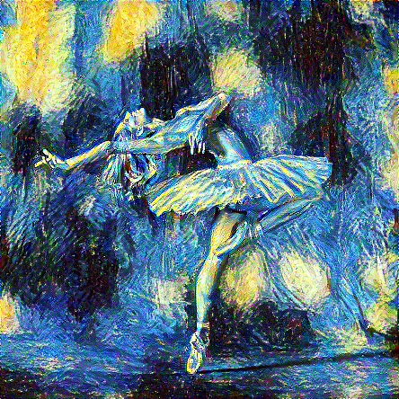
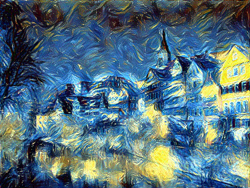

<h1 align="center">A Neural Algorithm of Artistic Style</h1>
PyTorch implementation of "A Neural Algorithm of Artistic Style" by Leon A. Gatys, Alexander S. Ecker, and Matthias Bethge.

<table>
  <tr>
    <td></td>
    <td></td>
    <td></td>
  </tr>
  <tr>
    <td></td>
    <td></td>
    <td></td>
  </tr>
  <tr>
    <td></td>
    <td></td>
    <td></td>
  </tr>
</table>

- lbfgs much better than adam
- larger images have much finer textures, perhaps due to size of kernels staying constant between small vs large images?
- style image has a big impact on whether the training is stable or not
  - picasso.jpg is very stable but starry_night.jpg is very unstable
