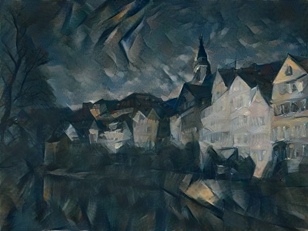
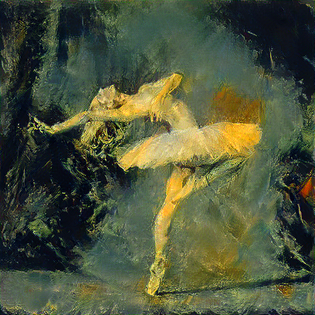
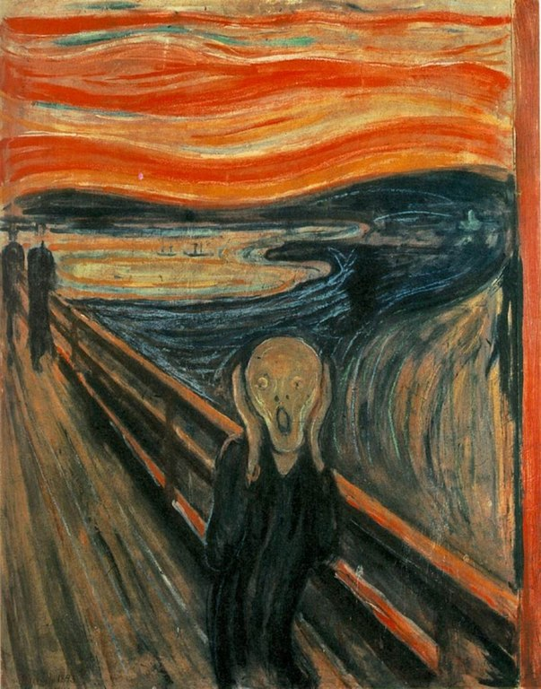
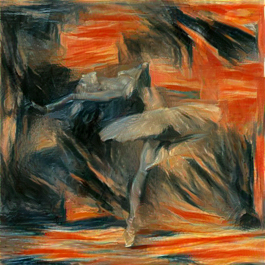

<!--
mlpi
title: A Neural Algorithm of Artistic Style
category: architectures/convolutional neural networks
images:  ,,output/05_10_2023/13_48_08_lbfgs/ballerina-picasso.png,output/05_10_2023/14_12_06/tubingen-starry_night.png,output/05_10_2023/18_04_11_loss_after_relu/tubingen-shipwreck.png, 
-->

<h1 align="center">A Neural Algorithm of Artistic Style</h1>
PyTorch implementation of "A Neural Algorithm of Artistic Style" by Leon A. Gatys, Alexander S. Ecker, and Matthias Bethge.

## Methods
Instead of optimizing model weights, the approach described in [1] optimizes pixel values in the input image, which means this neural
transfer algorithm works on images of arbitrary size. 

The `NeuralStyleTransfer` model is built directly from the layers in PyTorch's pretrained `vgg19` model. 
However, its `MaxPool2d` layers are replaced with `AvgPool2d` layers because average-pooling was found to produce better results in [1]. 
Furthermore, after each layer specified in `CONTENT_LAYERS` and `STYLE_LAYERS`, an appropriate loss probe 
(either `ContentLoss` or `StyleLoss`) was inserted to calculate the loss of the feature maps produced by those layers. 
During training, the total content and style losses from these layers are weighted by `CONTENT_WEIGHT` and `STYLE_WEIGHT` respectively to calculate the total loss.

Before training, the given style image is resized to be the same shape as the content image so that their corresponding feature maps have the same dimensions and their Gram matrices can be computed correctly.
Also, gradient calculations for the model weights are turned off since those do not need to be tuned. 
The final image is initialized as the original content image with some added white-noise and is optimized during training to become the results shown below.

## Results

  <table>
    <tr>
      <th align="center">
        Content Images →
          
        Style Images ↓
      </th>
      <td>
        
      </td>
      <td>
        
      </td>
    </tr>
    <tr>
      <td>
        
      </td>
      <td>
        
        

<b>Video</b>

      </td>
      <td>
        
        

<b>Video</b>

      </td>
    </tr>
    <tr>
      <td>
        
      </td>
      <td>
        
        

<b>Video</b>

      </td>
      <td>
        
        

<b>Video</b>

      </td>
    </tr>
    <tr>
      <td>
        
      </td>
      <td>
        
        

<b>Video</b>

      </td>
      <td>
        
        

<b>Video</b>

      </td>
    </tr>
    <tr>
      <td>
        
      </td>
      <td>
        
        

<b>Video</b>

      </td>
      <td>
        
        

<b>Video</b>

      </td>
    </tr>
    <tr>
      <td>
        
      </td>
      <td>
        
        

<b>Video</b>

      </td>
      <td>
        
        

<b>Video</b>

      </td>
    </tr>
  </table>

## Notes
The style images had a significant impact on the stability of the training loss. For `picasso.jpg` and `shipwreck.jpg`, the loss curve was smooth.
However, when training on `starry_night.jpg`, the loss spiked rather often.

The `LBFGS` optimizer converged much faster and produced much better results than `Adam`.

## References

[[1](https://arxiv.org/abs/1508.06576)] Leon A. Gatys, Alexander S. Ecker, Matthias Bethge. _A Neural Algorithm of Artistic Style_. 
arXiv:1508.06576v2 [cs.CV] 2 Sep 2015.
